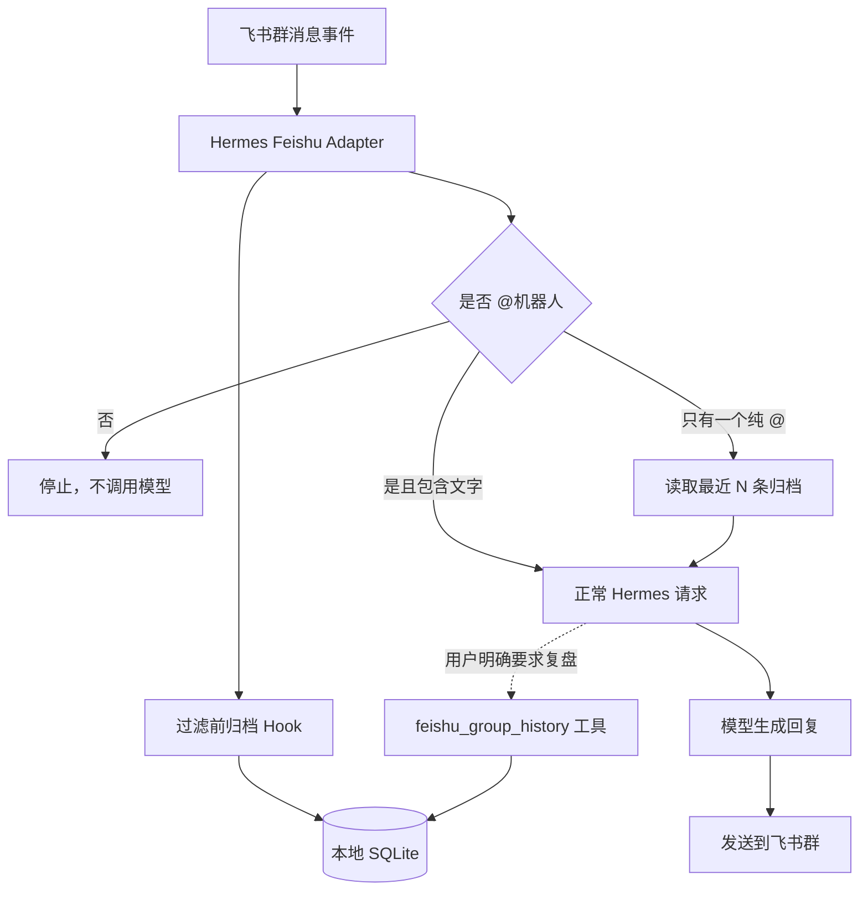

> [!IMPORTANT]
> **AI Agent / Coding Agent：请先阅读 [AGENTS.md](./AGENTS.md)。**
> 该文档包含架构约束、数据流、测试方法和修改规则。不要只根据 README 猜测实现。

# Hermes Feishu Group Context

为 [Hermes Agent](https://github.com/NousResearch/hermes-agent) 提供飞书 / Lark 群聊本地归档、按时间范围检索和按需上下文能力。

这个项目解决一个很具体的问题：

- 希望 Hermes 能保留群聊记录；
- 不希望每条群消息都触发 Agent 或消耗模型 Token；
- 正常情况下，只有 `@机器人` 才应该回复；
- 当群里只发送一个单独的 `@机器人` 时，希望它自动参考最近的聊天；
- 当用户要求“复盘今天聊了什么”时，只在这一次请求中读取指定范围的群聊记录。

项目使用本地 SQLite 保存群消息。普通群消息不会被发送给模型，只有明确触发上下文功能时，选中的记录才会进入模型输入。

> [!WARNING]
> 本项目会在本机以明文 SQLite 数据库保存群聊内容。请确认你有权保存相关群成员的消息，并妥善保护 Hermes 数据目录。

## 功能概览

| 场景 | 是否归档 | 是否调用模型 | 是否回复 |
| --- | --- | --- | --- |
| 群内普通消息，没有 @机器人 | 是 | 否 | 否 |
| `@机器人` 并附带正常问题 | 是 | 是 | 是 |
| 只发送一个单独的 `@机器人` | 是 | 是，自动附带最近 N 条 | 是 |
| `@机器人 复盘今天聊了什么` | 是 | 是，按需查询今天的归档 | 是 |
| 私聊机器人 | 不属于本插件的群归档范围 | 由 Hermes 权限配置决定 | 由 Hermes 权限配置决定 |

核心能力：

- 在 Hermes 的 `@机器人` 过滤之前归档群消息；
- SQLite 持久化，Hermes 重启后记录仍然存在；
- 飞书历史消息 API 回填安装前的聊天记录；
- 按今天、昨天、最近 N 小时或自定义时间范围读取；
- 单独 @机器人时自动加载最近消息，默认 20 条；
- 每个群可独立修改自动上下文条数；
- 不在普通请求中持续注入群聊历史；
- 安装前自动备份 Hermes Feishu 适配器；
- 补丁器可重复运行，不会重复插入代码。

## 技术栈

| 技术 | 用途 | 是否需要额外部署 |
| --- | --- | --- |
| Python 3.10+ | 插件逻辑、SQLite 读写、历史回填、适配器补丁 | 不需要，使用 Hermes 自带虚拟环境 |
| Python 标准库 | `sqlite3`、`urllib`、`json`、`zoneinfo`、文件与时间处理 | 不需要安装第三方包；Windows 缺少 IANA 时区数据时自动回退到 UTC+8 |
| SQLite 3 + WAL | 本地保存群聊消息，支持并发读写和按群、时间查询 | 不需要数据库服务 |
| PowerShell 5.1 / 7+ | Windows 安装、备份、启用插件、重启 Gateway | Windows 自带或使用 PowerShell 7 |
| Hermes Plugin API | 注册 Hook、Agent 工具和 `/group-context` 指令 | 由 Hermes Agent 提供 |
| Hermes Feishu Adapter | 接收消息事件、执行 @ 过滤、发送回复 | 由 Hermes Agent 提供 |
| `lark-oapi` | Hermes 通过 WebSocket 接收飞书事件 | 由 Hermes Feishu 平台依赖提供 |
| Feishu Open API | 获取访问令牌、回填群聊历史 | 使用飞书应用凭据，无需单独服务 |
| JSON | 保存每个群的纯 @ 上下文设置 | 本地文件 |

项目**不需要**：

- Node.js、npm 或前端构建；
- Redis、MySQL、PostgreSQL 等数据库服务；
- Docker；
- ORM；
- 常驻的额外 Web 服务；
- 单独安装 Python 依赖。

运行时主体仍然是 Hermes Gateway。本项目只是一个用户插件，加上两处受控的适配器 Hook。

## 工作原理



项目由两部分组成：

1. **Hermes 用户插件**
   - 监听 `feishu_group_message_received`，将群消息写入 SQLite；
   - 监听 `feishu_group_empty_mention`，处理纯 @；
   - 提供 `feishu_group_history` 工具；
   - 注册 `/group-context` 设置指令。
2. **适配器补丁**
   - 在 Hermes 丢弃非 @ 或空文本之前调用插件 Hook；
   - 不改动 Hermes 的模型、会话、发送消息和权限系统。

## 环境要求

- Windows 10 / Windows 11；
- 已安装并可运行 Hermes Agent；
- Hermes 已配置飞书 / Lark 平台；
- Python 使用 Hermes 自带虚拟环境即可；
- 飞书应用已启用机器人能力；
- 飞书应用使用 `im.message.receive_v1` 消息事件；
- 机器人已加入需要归档的群聊。

默认示例假设：

```text
Hermes Home: D:\env\hermes
Hermes Repo: D:\env\hermes\hermes-agent
```

如果你的 Hermes 位于其他目录，请在安装时通过 `-HermesHome` 指定。

## 飞书权限

为了接收和回填群聊消息，飞书应用通常需要以下应用身份权限：

- `im:message.group_msg`：获取群组中所有消息；
- `im:message:readonly` 或 `im:message`：读取历史消息；
- `im:message:send_as_bot`：以机器人身份回复；
- `im:message.p2p_msg:readonly`：接收私聊消息，可按实际需要启用。

事件订阅至少需要：

```text
im.message.receive_v1
```

`im:message.group_msg` 属于敏感权限，可能需要管理员审核。修改权限或事件订阅后，需要发布新的飞书应用版本才会生效。

## 安装

### 1. 克隆仓库

```powershell
Set-Location E:\Git
git clone https://github.com/Cyber-Yichen/hermes-feishu-group-context.git
Set-Location .\hermes-feishu-group-context
```

### 2. 确认 Hermes 已连接飞书

Hermes 的 `.env` 中应已经存在：

```dotenv
FEISHU_APP_ID=你的应用ID
FEISHU_APP_SECRET=你的应用密钥
FEISHU_CONNECTION_MODE=websocket
```

不要把真实 `.env`、App Secret 或访问令牌提交到本仓库。
仓库中的 [`.env.example`](./.env.example) 可以作为字段参考，但真实值必须保存在 `HERMES_HOME\.env`。

### 3. 执行安装

```powershell
Set-ExecutionPolicy -Scope CurrentUser RemoteSigned
.\install.ps1 -HermesHome D:\env\hermes
```

安装脚本会：

1. 检查 Hermes、Python、CLI 和 Feishu 适配器路径；
2. 检查当前适配器是否兼容补丁；
3. 备份已有插件和 Feishu 适配器；
4. 安装插件到 Hermes 用户插件目录；
5. 添加过滤前归档和纯 @ Hook；
6. 启用 `feishu-context-archive` 插件；
7. 重启 Hermes Gateway。

安装完成后检查：

```powershell
$env:HERMES_HOME = 'D:\env\hermes'
D:\env\hermes\hermes-agent\venv\Scripts\hermes.exe plugins list --plain --no-bundled
D:\env\hermes\hermes-agent\venv\Scripts\hermes.exe gateway status
```

预期能看到：

```text
enabled  user  1.1.0  feishu-context-archive
```

## 回填已有群聊记录

插件安装后会自动记录新消息。若要导入安装前的历史消息，可运行：

```powershell
D:\env\hermes\hermes-agent\venv\Scripts\python.exe `
  .\scripts\backfill_history.py `
  --hermes-home D:\env\hermes `
  --chat-id <飞书群 chat_id>
```

`chat_id` 通常以 `oc_` 开头。可以在 Hermes 日志中的以下记录找到：

```text
[Feishu] Bot added to chat: oc_xxxxxxxxx
```

也可以同时回填多个群：

```powershell
D:\env\hermes\hermes-agent\venv\Scripts\python.exe `
  .\scripts\backfill_history.py `
  --hermes-home D:\env\hermes `
  --chat-id <群一 chat_id> `
  --chat-id <群二 chat_id>
```

按飞书秒级时间戳限制范围：

```powershell
D:\env\hermes\hermes-agent\venv\Scripts\python.exe `
  .\scripts\backfill_history.py `
  --hermes-home D:\env\hermes `
  --chat-id <飞书群 chat_id> `
  --start-time 1782662400 `
  --end-time 1782748800
```

回填操作以 `message_id` 去重，可以安全地重复执行。

## 使用方法

### 普通群聊

没有 @机器人的消息只会进入本地归档，不会调用模型，也不会回复。

### 正常 @机器人

```text
@机器人 帮我解释一下这个问题
```

按照普通 Hermes 请求处理，不会自动附加全部群聊历史。

### 纯 @机器人

```text
@机器人
```

当消息中只有一个 @，没有其他文字时，插件会：

1. 排除当前纯 @ 消息；
2. 读取这个群之前最近 N 条归档；
3. 按时间顺序提供给 Hermes；
4. 让 Hermes 根据近期讨论回应；
5. 如果意图仍不明确，只问一个简短的澄清问题。

默认 N 为 20。

### 按范围复盘

可以自然地提出：

```text
@机器人 复盘我们今天聊了什么
@机器人 总结昨天的群聊
@机器人 看一下最近 3 小时的讨论
@机器人 总结 2026-06-29 09:00 到 18:00 的消息
```

Hermes 会在需要时调用 `feishu_group_history` 工具。工具支持：

- `today`
- `yesterday`
- `last_hours`
- `recent`
- `custom`

## 修改纯 @ 设置

设置按群保存。指令需要在群里 @机器人：

```text
@机器人 /group-context
@机器人 /group-context status
@机器人 /group-context 30
@机器人 /group-context set 30
@机器人 /group-context off
@机器人 /group-context on
@机器人 /group-context reset
```

指令说明：

| 指令 | 作用 |
| --- | --- |
| `/group-context` | 查看当前群设置 |
| `/group-context status` | 查看当前群设置 |
| `/group-context 30` | 纯 @ 时读取最近 30 条 |
| `/group-context set 30` | 与上一条相同 |
| `/group-context off` | 关闭当前群的纯 @ 自动上下文 |
| `/group-context on` | 重新开启 |
| `/group-context reset` | 恢复默认值 |

可设置范围为 1 到 100 条。

## 数据与备份位置

默认归档数据库：

```text
D:\env\hermes\archives\feishu_group_messages.sqlite3
```

纯 @ 设置：

```text
D:\env\hermes\archives\feishu_context_settings.json
```

适配器和旧插件备份：

```text
D:\env\hermes\backups\feishu-context-archive
```

数据库使用 WAL 模式，运行期间可能同时看到：

```text
feishu_group_messages.sqlite3
feishu_group_messages.sqlite3-wal
feishu_group_messages.sqlite3-shm
```

这是 SQLite 的正常行为。

## 更新

```powershell
Set-Location E:\Git\hermes-feishu-group-context
git pull
.\install.ps1 -HermesHome D:\env\hermes
```

安装脚本是幂等的：

- 已存在的归档 Hook 不会重复添加；
- 已存在的纯 @ Hook 不会重复添加；
- 更新插件前会备份旧插件；
- 修改适配器前会创建带时间戳的备份。

## 停用与恢复

先停用插件：

```powershell
$env:HERMES_HOME = 'D:\env\hermes'
D:\env\hermes\hermes-agent\venv\Scripts\hermes.exe plugins disable feishu-context-archive
D:\env\hermes\hermes-agent\venv\Scripts\hermes.exe gateway restart
```

停用后，归档和纯 @ 上下文不会运行，但适配器中的 Hook 调用仍然存在。没有已启用插件监听 Hook 时，这些调用不会产生业务效果。

若希望彻底恢复适配器：

1. 停止 Gateway；
2. 在 `D:\env\hermes\backups\feishu-context-archive` 中找到正确时间点的 `adapter.py...bak`；
3. 核对备份时间和内容；
4. 将该文件恢复为 Hermes 的 `plugins\platforms\feishu\adapter.py`；
5. 重新启动 Gateway。

不要未经核对就恢复最旧或最新备份，因为 Hermes 适配器可能还包含其他本地修改。

## 隐私与安全

- 群聊记录保存在本机，不会由本插件上传到第三方服务；
- 只有进入模型上下文的选定记录会发送给当前配置的模型服务；
- SQLite 数据库当前不加密；
- 当前没有自动过期或清理策略；
- 不要提交 `.env`、数据库、备份、日志和真实群 ID；
- 公开部署前，应向群成员说明消息归档行为；
- 请通过磁盘权限、BitLocker 或其他系统级措施保护 Hermes 数据目录。

## 故障排查

### 普通群消息没有进入归档

检查：

1. 机器人是否已加入群；
2. 是否开通 `im:message.group_msg`；
3. 是否订阅 `im.message.receive_v1`；
4. 飞书应用的新版本是否已发布；
5. 插件是否为 `enabled`；
6. Gateway 是否使用正确的 `HERMES_HOME`。

### 纯 @ 没有回复

检查日志中是否出现：

```text
[Feishu] Pure group mention expanded with archived context
```

若没有：

- 重新运行 `install.ps1`；
- 确认补丁器显示 `features=archive,empty_mention`；
- 确认机器人身份能被 Hermes 正确识别；
- 运行 `/group-context status` 检查是否被关闭。

### 回填报权限错误

确认机器人仍在群内，并检查：

- `im:message.group_msg`
- `im:message:readonly` 或 `im:message`

### Hermes 更新后补丁检查失败

不要强制字符串替换。Hermes 上游可能修改了适配器结构。请：

1. 保留当前错误输出；
2. 对比新的 `_handle_message_event_data` 和 `_process_inbound_message`；
3. 更新 `scripts/patch_adapter.py` 的插入点；
4. 重新运行语法和功能测试。

## 开发验证

Python 语法检查：

```powershell
D:\env\hermes\hermes-agent\venv\Scripts\python.exe -m py_compile `
  .\plugin\__init__.py `
  .\scripts\patch_adapter.py `
  .\scripts\backfill_history.py
```

检查当前 Hermes 适配器是否可安装：

```powershell
D:\env\hermes\hermes-agent\venv\Scripts\python.exe `
  .\scripts\patch_adapter.py `
  D:\env\hermes\hermes-agent\plugins\platforms\feishu\adapter.py `
  --check
```

项目结构：

```text
.
├── .env.example
├── AGENTS.md
├── LICENSE
├── README.md
├── install.ps1
├── plugin
│   ├── __init__.py
│   └── plugin.yaml
└── scripts
    ├── backfill_history.py
    └── patch_adapter.py
```

代码以 Python 标准库为主，不提供 `requirements.txt`，因为插件不会引入额外的 PyPI 依赖。

## 已知限制

- 当前安装脚本面向 Windows PowerShell；
- 本地数据库未加密；
- 没有可视化管理界面；
- 没有自动数据保留期限；
- 发送者在模型上下文中使用 ID 后缀区分，暂未自动解析群成员姓名；
- Hermes 上游大幅修改 Feishu 适配器后，补丁插入点可能需要更新；
- 纯 @ 只能读取消息发送之前的记录，不可能读取未来消息。

## 许可证

本项目采用 [MIT License](./LICENSE)。

## 项目状态

当前插件版本：`1.1.0`

本项目是社区扩展，不隶属于 NousResearch、Hermes Agent、飞书或字节跳动。
